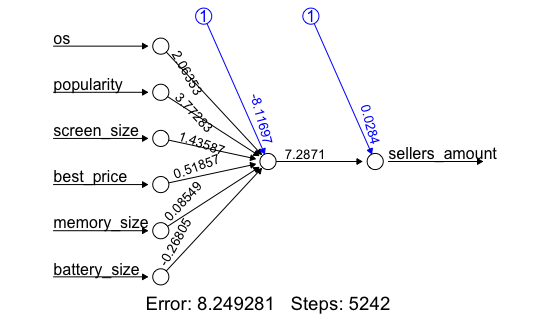

# Predicting mobile seller count from related data

## Workflow
- Step 1: As of now I don’t know which data I should keep or remove. I will just go by guessing.

- Step 2: I am seeing that all the data is from the same brand. So I will be removing the brand column, as it seems of no use to me.

My analysis: 
There are

| OS  | Number of devices |
| ------------- | ------------- |
| Android  | 915  |
| EMUI  | 2  |
| iOS  | 103  |
| KAiOS  | 1  |
| OxygenOS  | 3  |
| WindowsPhone  | 3  |
| Others  | 197  |

- Step 3: Replacing the os data with this numeric value:

| Name of the OS  | Replaced by |
| ------------- | ------------- |
| Android  | 0  |
| EMUI  | 1  |
| iOS  | 3  |
| KAiOS  | 4  |
| OxygenOS  | 5  |
| WindowsPhone  | 6  |
| Others  | 7  |

- Step 4: Still I do see there are some missing values in lowest price and highest price. I am thinking of solving them in the coding environment

- Step 5: Seeing a memory size column where a few featured phones are listed as the memory size doesn't matter there. I will replace those null values with 0s.

- Step 6: Filled the missing screen size from Google search
The ```final_data.csv``` is the data on which we will be working on.

# Coding

## Library Used
```R
library(tidyverse)
library(ggplot2)
library(caret)
library(car)
library(neuralnet)
library(Metrics)
library(magrittr) # needs to be run every time you start R and want to use %>%
library(dplyr)    # alternatively, this also loads %>%
library(GGally)
```



## RMSE
```0.12```
